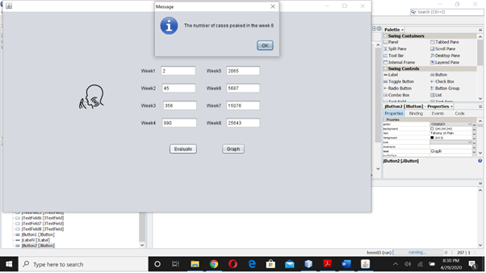
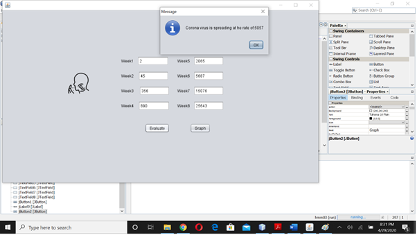
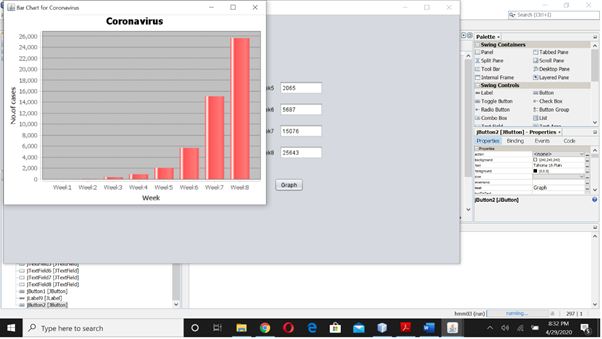

# Covid19Analyzer
Covid19 Analyzer built using Java

# Abstract
Coronaviruses (CoV) are a large family of viruses that cause illness ranging from the common cold to more severe diseases such as Middle East Respiratory Syndrome (MERS-CoV) and Severe Acute Respiratory Syndrome (SARS-CoV). The disease has taken the world by shock and has led to many countries put their respective countries into lockdown to avoid the spread of the same.  
Coronavirus disease (COVID-19) is a new strain that was discovered in 2019 and has not been previously identified in humans.
Common signs of infection include respiratory symptoms, fever, cough, shortness of breath and breathing difficulties. In more severe cases, infection can cause pneumonia, severe acute respiratory syndrome, kidney failure and even death.  
Our idea is to analyze the situation of the country, by taking the input of number of cases weekly(as there is no API to do the same) and give a report at the end of the 8th week and suggest some precautionary measures to tackle the same.

# SCREENSHOTS:

