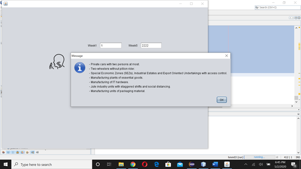

# Covid19Analyzer
Covid19 Analyzer built using Java

# Abstract
Coronaviruses (CoV) are a large family of viruses that cause illness ranging from the common cold to more severe diseases such as Middle East Respiratory Syndrome (MERS-CoV) and Severe Acute Respiratory Syndrome (SARS-CoV). The disease has taken the world by shock and has led to many countries put their respective countries into lockdown to avoid the spread of the same.  
Coronavirus disease (COVID-19) is a new strain that was discovered in 2019 and has not been previously identified in humans.
Common signs of infection include respiratory symptoms, fever, cough, shortness of breath and breathing difficulties. In more severe cases, infection can cause pneumonia, severe acute respiratory syndrome, kidney failure and even death.  
Our idea is to analyze the situation of the country, by taking the input of number of cases weekly(as there is no API to do the same) and give a report at the end of the 8th week and suggest some precautionary measures to tackle the same.

# Problem Statement
In the present context Corona Virus poses high threat to human lives, economy of any country. Its been observed from many researches that an eight-week data of number of cases is required to analyze the situation of any country. So our idea is to analyze the situation of any country, by taking the input of number of cases weekly(as there is no API to do the same) and to give a report at the end of the 8th week and suggest some precautionary measures to tackle the same.

# Introduction
JFreeChart is open source and 100% free, which permits usage in the commercial applications without any cost. We have enlisted here some more points in favor of why you should use JFreeChart −
●	It comes with well documented APIs, which makes it quite easy to understand.
●	It supports a wide range of chart types such as Pie Chart, Line Chart, Bar Chart, Area Chart and 3D charts.
●	JFreeChart is easy to extend and can be used in both, the client-side, as well as the server-side applications.
●	It supports multiple output formats like PNG, JPEG, PDF, SVG etc.
●	It allows extensive customizations of charts.
Consider a situation where you are developing an application and you need to show the data in the form of charts, and the data itself is populated dynamically. In such a case, displaying the data in the form of charts using JFreeChart programming is very simple.

# SCREENSHOTS:

